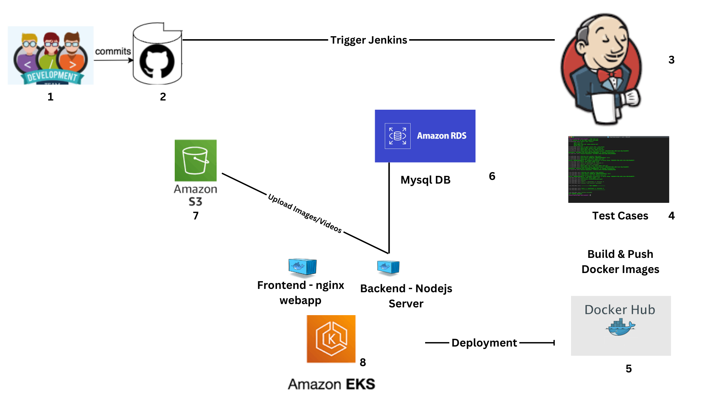
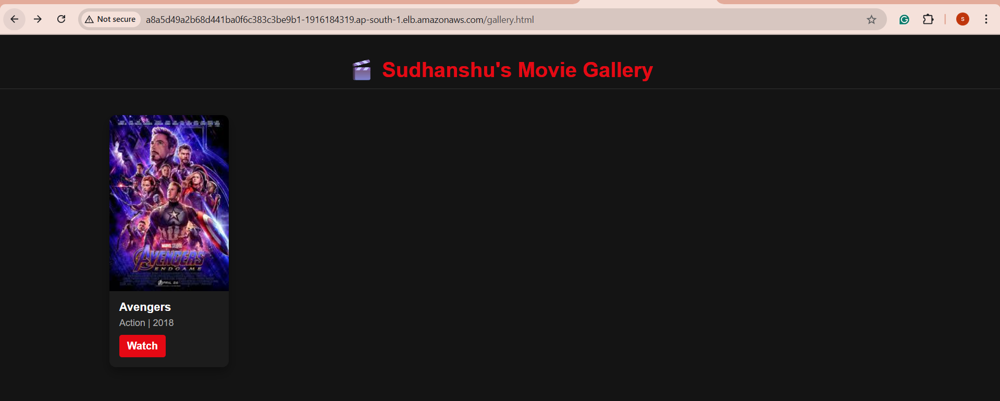

# Devops-Movie-Streaming-APP

📺 Missed the sessions? Watch the full workshop here(Youtube):
- 🔗 Day1(Introduction to Devops): https://www.youtube.com/watch?v=JRmV_mKnnyU
- 🔗 Day2(Docker): https://www.youtube.com/watch?v=b0jb_uC9Dck
- 🔗 Day3(Movie Streaming App practical & EKS): https://www.youtube.com/watch?v=Cy4nay9PcA4

The architecture diagram below illustrates the interactions between the services:




## Overview

The DevOps Movie Streaming App is a FullStack application built using **Express**, **Node.js**, **HTML**, **CSS**, and **MySQL**. This application allows an admin to add movies to a database by providing detailed information, such as the title, genre, description, rating, release year, and associated media (images and videos). The application features four main webpages:

- **Gallery**: Displays a gallery of all available movies.
- **Register**: Allows admins to add new movies to the database.
- **Search**: Provides a search interface to find movies by title or genre.
- **Watch**: Enables users to watch selected movies.



The backend is built using Express.js and exposes an API endpoint at `/movies` for managing movie data. Movie media files (images and videos) are uploaded to an AWS S3 bucket using the AWS SDK.

## Project Architecture

The project follows a multi-container Docker architecture consisting of three main services:

1. **Frontend**: A static website served by Nginx, which hosts the HTML, CSS, and Frontend JavaScript files.
2. **Backend**: A Node.js application that handles API requests, processes data, and interacts with the MySQL database.
3. **Database**: A RDS database for storing movie details.

## Features

- **Multi-Container Deployment**: The application is containerized using Docker, with separate containers for the frontend, backend, We are using K8s as an container orchestration tool to manage the life cycle of containers.
- **AWS S3 Integration**: Media files are stored securely in an AWS S3 bucket.
- **CI-CD Pipeline**: A Jenkins CI-CD pipeline is used to deploy the application on an AWS EKS

## How to Run the Application

### Prerequisites

- **Docker**: Ensure Docker is installed on your system.
- **AWS CLI**: Configure your AWS credentials for S3 access.
- **Jenkins**: Set up a Jenkins server for CI/CD.

### Running the Application

1. **Fork & Clone the repository**:
    - Fork the repository https://github.com/sudhanshuvlog/Movie-Streaming-App-DevOps.git
    - Once you have forked the repo on your github account, Clone the repo in your system
        ```bash
        git clone <your repo URL>
        cd Movie-Streaming-App-DevOps
        ```

2. **Launch Server**
    - Launch an AWS EC2 Instance with `t2.medium` as Instance Type, and Give atleast 15GB of EBS Volume.
    - In `Security Group` you can allow all the trafic.

3. **Jenkins Setup**:

- Launch Jenkins Server:
    ```bash
    docker run -p 8080:8080 -p 50000:50000 -dit --name jenkins --restart=on-failure jenkins:lts-jdk17
    ```

- Configure Jenkins Slave Node:
   - Follow this doc to add a agent in Jenkins https://www.jenkins.io/doc/book/using/using-agents/
   - On your Jenkins slave node, install JDK 17(You can make your base Ec2 Instance as slave node):
    
    ``` bash
    wget https://download.oracle.com/java/17/archive/jdk-17.0.10_linux-x64_bin.rpm
    yum install jdk-17.0.10_linux-x64_bin.rpm -y
    ```
    - Start the agent and join it to the Jenkins Master Node using the provided join command.
    - Install `git` in slave node, as it will be further used while cloning the repo
        ```bash
        yum install git -y
        ```

5. **AWS S3 Bucket**

    - Media files are stored securely in an AWS S3 bucket, Hence we need to create an AWS S3 bucket which will be further used by our application, In my case i have created an s3 bucket with the name `moviebucketsudhanshuvlog` in the ap-south-1 region, If you wanted to change the bucket name, then you can update the variable called `Bucket` in the `app.js` file
    - Once you have created the bucket in AWS, You also need to enable the public access to the bucket, 
    and you have to add an bucket policy(which will allow you to get the objects stored in bucket), In the below bucket policy just modify your `ARN Number`

        ```
        {
        "Version": "2012-10-17",
        "Statement": [
            {
                "Sid": "PublicReadGetObject",
                "Effect": "Allow",
                "Principal": "*",
                "Action": "s3:GetObject",
                "Resource": "<ARN Number>/*"
            }
        ]
        }
        ```

6. **Continuous Integration & Deployment**

    CI/CD Pipeline: The CI/CD pipeline Checks code quality using SonarQube and then it builds Docker images with tags `jinny1/movie-streaming-backend-nodejs:latest` and `jinny1/movie-streaming-frontend:latest` and pushes them to DockerHub. Now it will deploy the application using these docker images

    - Jenkins (for Continuous Integration)
        The project includes a CI-CD pipeline defined in `Jenkinsfile`, which performs the following steps:

        - Execute Test Cases
        - Docker Build & Push: Builds Docker images for the frontend and backend and pushes them to DockerHub.
        - As Pipeline is using some Secrets, Hence create the secrets from `Jenkins Credential Manager`

    - Jenkins (for Continuous Deployment)

        - Jenkins will Deploy the application on EKS cluster. `/deploy` directory has all the k8s yaml scripts.

7. **Latest Docker Image**
- My Latest docker image for this project are present here, You can use this image as well, If you don't wanted to build your own image
    - https://hub.docker.com/r/jinny1/movie-streaming-frontend
    - https://hub.docker.com/r/jinny1/movie-streaming-backend-nodejs


9. **Contact**
    For any inquiries or issues, please contact [me](https://www.linkedin.com/in/sudhanshu--pandey/)


### Configure AWS EKS Cluster

### Step 1: Configure AWS Credentials
  `aws configure` Make sure you have created your credentials in the AWS IAM service.

### Step 2: Install eksctl
  eksctl is a simple CLI tool for creating and managing EKS clusters. Install eksctl using the following commands:

  ``` bash 
  curl --silent --location "https://github.com/weaveworks/eksctl/releases/latest/download/eksctl_$(uname -s)_amd64.tar.gz" | tar xz -C /tmp
  sudo mv /tmp/eksctl /usr/local/bin
  eksctl version
  ```
### Step 3: Install kubectl
  kubectl is a command-line tool used to interact with Kubernetes clusters. Install it to manage your EKS cluster:

  ````bash
  curl -o kubectl https://amazon-eks.s3.us-west-2.amazonaws.com/1.19.6/2021-01-05/bin/linux/amd64/kubectl
  chmod +x ./kubectl
  sudo mv ./kubectl /usr/local/bin
  kubectl version --short --client
  ````

### Step 4: Create the EKS Cluster
  The following command creates a new EKS cluster named EKS-1 in the ap-south-1 region. No worker nodes will be created at this stage.

    eksctl create cluster --name EKS21 --region ap-south-1 --vpc-public-subnets=subnet-0e64ffc947ac8929c,subnet-04c1ed6ba9c55ffd7 --nodegroup-name default-ng --node-type t3.medium --nodes=2 --nodes-min=2 --nodes-max=2 --node-volume-size=20 --ssh-access --ssh-public-key DevOps --managed

### Code Explanation


1. **Explanation of app.js file**

    - A Node.js backend server for managing a movie database with functionalities like file uploads to AWS S3, MySQL database interactions, and RESTful API endpoints.

    - Features

        - **File Uploads**: Handles image and video uploads using Multer and stores them in AWS S3.
        - **MySQL Database**: Stores movie metadata like title, genre, description, and more.
        - **REST API**: Provides endpoints for creating, fetching, and searching movies.

    - Technologies Used

        - **Express.js**: Web framework for Node.js.
        - **MySQL2**: MySQL client for database operations.
        - **Multer**: Middleware for handling file uploads.
        - **AWS SDK (S3)**: Interact with Amazon S3 for file storage.
        - **UUID**: Generates unique filenames for uploaded files.
        - **CORS**: Enables cross-origin resource sharing.

    - Endpoints

        - `POST /movies` - Register a new movie with an image and video.
        - `GET /movies` - Fetch all movies.
        - `GET /movies/:id` - Fetch a specific movie by ID.
        - `GET /movies/search?query=<query>` - Search movies by title or genre.

    - Environment Variables: following environment variables are configured:

        DB_HOST, DB_USER, DB_PASSWORD, DB_NAME for MySQL connection.
        AWS_REGION, AWS_ACCESS_KEY_ID, AWS_SECRET_ACCESS_KEY for AWS S3.
