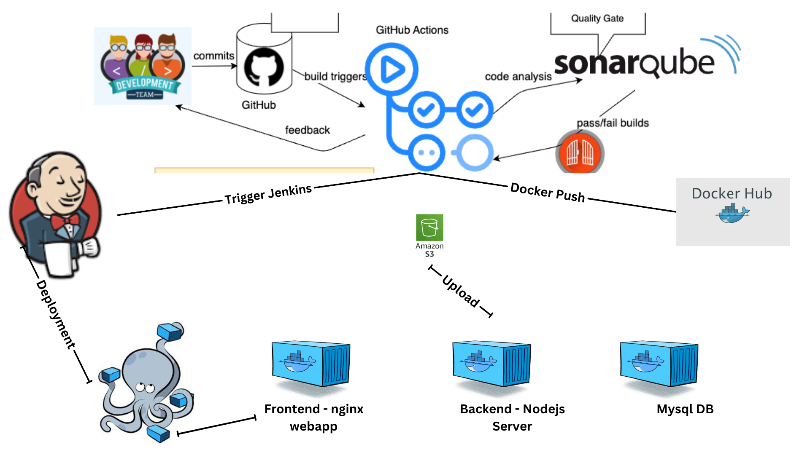
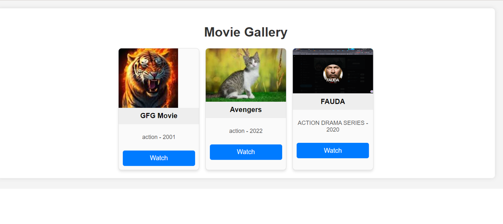

# Devops-Movie-Streaming-APP

The architecture diagram below illustrates the interactions between the services:




## Overview

The DevOps Movie Streaming App is a FullStack application built using **Express**, **Node.js**, **HTML**, **CSS**, and **MySQL**. This application allows an admin to add movies to a database by providing detailed information, such as the title, genre, description, rating, release year, and associated media (images and videos). The application features four main webpages:

- **Gallery**: Displays a gallery of all available movies.
- **Register**: Allows admins to add new movies to the database.
- **Search**: Provides a search interface to find movies by title or genre.
- **Watch**: Enables users to watch selected movies.



The backend is built using Express.js and exposes an API endpoint at `/movies` for managing movie data. Movie media files (images and videos) are uploaded to an AWS S3 bucket using the AWS SDK.

## Project Architecture

The project follows a multi-container Docker architecture consisting of three main services:

1. **Frontend**: A static website served by Nginx, which hosts the HTML, CSS, and Frontend JavaScript files.
2. **Backend**: A Node.js application that handles API requests, processes data, and interacts with the MySQL database.
3. **Database**: A MySQL:8 database for storing movie details.

## Features

- **Multi-Container Deployment**: The application is containerized using Docker, with separate containers for the frontend, backend, and database.
- **AWS S3 Integration**: Media files are stored securely in an AWS S3 bucket.
- **Continuous Integration**: GitHub Actions are used to build and test the application, with SonarQube integrated for code quality analysis. (CI)
- **Jenkins Deployment**: A Jenkins pipeline is used to deploy the application on an AWS EC2 instance. (CD)

## How to Run the Application

### Prerequisites

- **Docker**: Ensure Docker is installed on your system.
- **Docker Compose**: Required to manage the multi-container setup.
- **AWS CLI**: Configure your AWS credentials for S3 access.
- **Jenkins**: Set up a Jenkins server for CI/CD.

### Running the Application

1. **Fork & Clone the repository**:
    - Fork the repository https://github.com/sudhanshuvlog/Movie-Streaming-App-DevOps.git
    - Once you have forked the repo on your github account, Clone the repo in your system
        ```bash
        git clone <your repo URL>
        cd Movie-Streaming-App-DevOps
        ```

2. **Launch Server**
    - Launch an AWS EC2 Instance with `t2.medium` as Instance Type, and Give atleast 15GB of EBS Volume.
    - In `Security Group` you can allow all the trafic.

3. **Jenkins Setup**:

- Launch Jenkins Server:
    ```bash
    docker run -p 8080:8080 -p 50000:50000 -dit --name jenkins --restart=on-failure -v jenkins_home:/var/jenkins_home jenkins/jenkins:lts-jdk17
    ```

- Configure Jenkins Slave Node:
   - Follow this doc to add a agent in Jenkins https://www.jenkins.io/doc/book/using/using-agents/
   - On your Jenkins slave node, install JDK 17(You can make your base Ec2 Instance as slave node):
    
    ``` bash
    wget https://download.oracle.com/java/17/archive/jdk-17.0.10_linux-x64_bin.rpm
    yum install jdk-17.0.10_linux-x64_bin.rpm -y
    ```
    - Start the agent and join it to the Jenkins Master Node using the provided join command.
    - Install `git` in slave node, as it will be further used while cloning the repo
        ```bash
        yum install git -y
        ```

4. **SonarQube Configuration**
    
    - The SonarQube server will be hosted on an AWS EC2 instance(you can host it on same ec2 instance where jenkins server is running). Refer to the `docker-compose.yml` in the `/build` directory for setting up the SonarQube server.

    ``` bash
    sudo curl -L "https://github.com/docker/compose/releases/latest/download/docker-compose-$(uname -s)-$(uname -m)" -o /usr/local/bin/docker-compose
    chmod +x /usr/local/bin/docker-compose
    docker-compose --version
    docker-compose up -d
    ```
    
    - Now SonarQube Server would be running on port no 9000, you can hit to <EC2 Public IP:9000>, by default the username and password of Sonarqube will be `admin`

5. **AWS S3 Bucket**

    - Media files are stored securely in an AWS S3 bucket, Hence we need to create an AWS S3 bucket which will be further used by our application, In my case i have created an s3 bucket with the name `moviebucketsudhanshuvlog` in the ap-south-1 region, If you wanted to change the bucket name, then you can update the variable called `Bucket` in the `app.js` file
    - Once you have created the bucket in AWS, You also need to enable the public access to the bucket, 
    and you have to add an bucket policy(which will allow you to get the objects stored in bucket), In the below bucket policy just modify your `ARN Number`

        ```
        {
        "Version": "2012-10-17",
        "Statement": [
            {
                "Sid": "PublicReadGetObject",
                "Effect": "Allow",
                "Principal": "*",
                "Action": "s3:GetObject",
                "Resource": "<ARN Number>/*"
            }
        ]
        }
        ```

6. **Continuous Integration & Deployment**

    CI/CD Pipeline: The CI/CD pipeline Checks code quality using SonarQube and then it builds Docker images with tags `jinny1/movie-streaming-backend-nodejs:latest` and `jinny1/movie-streaming-frontend:latest` and pushes them to DockerHub. Now it will deploy the application using these docker images

    - GitHub Actions (for Continuous Integration)
        The project includes a CI pipeline defined in `.github/workflows/sonarqube-scan.yml`, which performs the following steps:

        - SonarQube Analysis: Checks code quality using SonarQube.
        - Docker Build & Push: Builds Docker images for the frontend and backend and pushes them to DockerHub.
        - As workflow is using some Secrets, Hence create the secrets from `setting->Secrets and Variables-> Actions -> Repository secrets`

            - **SONAR_TOKEN:** Token for SonarQube authentication.
            - **SONAR_HOST_URL:** URL for the SonarQube server.
            - **DOCKERHUB_USERNAME:** Docker Hub username.
            - **DOCKERHUB_TOKEN:** Docker Hub token for authentication.

    - Jenkins (for Continuous Deployment)

        - Define your pipeline in Jenkins, which will use the `./docker-compose.yml` file to start all the services(frontend, backend and database).

        - **IMP** You need to change the IP of your EC2 Instance in the `./docker-compose.yml` file, Just replace the IP address defined in the environmental variable for `node-app` the keyword name is `DB_HOST`
        and in `web` the keyword name os `API_URL`

        - Manuall Deployment(optional)

            - Create a .env file in your jenkins slave node from where you are going to execute the above `docker-compose.yml` file:

                Create a .env file in the root directory to store your environment variables. This file should include your AWS S3 credentials, and other sensitive information.
                
                ```bash
                touch .env
                ```

                Example .env file:
                ```
                AWS_ACCESS_KEY_ID=your-access-key
                AWS_SECRET_ACCESS_KEY=your-secret-key
                ```
        - **Automation Deployment With Jenkins** 
            - Create a Credential in Jenkins:
                - Go to Jenkins and create a new credential.
                - Select "Secret file" and upload your .env file from your system.
                - Give an ID to this secret, which will be referenced in your Jenkinsfile.
                
            - Set Up the Jenkins Pipeline:

                - Create a new pipeline job in Jenkins.
                - Configure the Source Code Management (SCM) with your GitHub repository URL.
                - Enable webhooks for seamless integration by going to GitHub and allowing a webhook with the path http://<Jenkins-IP>:8080/github-webhook/. This ensures Jenkins triggers automatically when changes are pushed to the repository.
                
            - Jenkinsfile Configuration `Jenkinsfile`:

                - The pipeline configuration is defined in a Jenkinsfile. This script specifies the environment, stages, and steps for the deployment process.
                - The environment variable ENV loads the credentials from the secret file you uploaded earlier.
                - Deployment Steps:

                    - Stage: Deploy the Multi-Container Application:
                    - Copy the Environment File: The .env file is copied to the current directory using the command sh 'cp $ENV .env'.
                    - Pull the Latest Docker Images: sh 'docker-compose pull' pulls the latest images for your services defined in the docker-compose.yml file.
                    - Stop and Remove Existing Containers: The existing web and node-app containers are stopped and removed to ensure that old containers are deleted before starting new ones with updated images.
                    - Start New Containers: Finally, sh 'docker-compose up -d' starts the containers from the new Docker images, ensuring the application is up-to-date.

7. **Latest Docker Image**
- My Latest docker image for this project are present here, You can use this image as well, If you don't wanted to build your own image
    - https://hub.docker.com/r/jinny1/movie-streaming-frontend
    - https://hub.docker.com/r/jinny1/movie-streaming-backend-nodejs

8. **Debugging Steps**
    
    - Stopping Containers:
        Use `docker-compose down` to gracefully terminate all containers created by the docker-compose file. This command also removes the networks created by docker-compose up, making it useful when you need to clean up the environment before redeploying.

    - Checking Logs:
        To diagnose issues with a specific container, such as `node-app`, use `docker logs node-app`. This command displays the container's logs, which can be crucial for identifying problems like a failed connection to a database.

    - Restarting Containers:
        If node-app fails to connect to the database, one potential solution is to restart the container using `docker restart node-app`. This action can reinitialize the connection and resolve transient issues without requiring a full stack restart.

9. **Contact**
    For any inquiries or issues, please contact [me](https://www.linkedin.com/in/sudhanshu--pandey/)


### Code Explanation

1. **GitHub Actions Workflow: Test and build docker images**

    - This repository contains a GitHub Actions workflow that automates code analysis and Docker image management.

    - Workflow Trigger: The workflow runs on every push to the `main` branch.

    - Jobs

        - Build and Analyze

            - **Runs on:** `ubuntu-latest`
            - **Steps:**
            - **Checkout Code:** Retrieves the repository code for analysis.
            - **SonarQube Scan:** Analyzes code quality and security using SonarQube. Requires `SONAR_TOKEN` and `SONAR_HOST_URL` secrets.
            - **SonarQube Quality Gate:** Optionally checks if the code meets the defined quality gate.

        - Docker Build and Push

            - **Runs on:** `ubuntu-latest`
            - **Steps:**
            - **Set up QEMU and Docker Buildx:** Prepares the environment for multi-platform Docker builds.
            - **Login to Docker Hub:** Authenticates using Docker Hub credentials stored in secrets.
            - **Build and Push Docker Images:** Builds Docker images from specified Dockerfiles and pushes them to Docker Hub.

        - Secrets Required

        - **SONAR_TOKEN:** Token for SonarQube authentication.
        - **SONAR_HOST_URL:** URL for the SonarQube server.
        - **DOCKERHUB_USERNAME:** Docker Hub username.
        - **DOCKERHUB_TOKEN:** Docker Hub token for authentication.

        This workflow helps maintain code quality and automates the deployment process by building and pushing Docker images.

2. **Explanation of app.js file**

    - A Node.js backend server for managing a movie database with functionalities like file uploads to AWS S3, MySQL database interactions, and RESTful API endpoints.

    - Features

        - **File Uploads**: Handles image and video uploads using Multer and stores them in AWS S3.
        - **MySQL Database**: Stores movie metadata like title, genre, description, and more.
        - **REST API**: Provides endpoints for creating, fetching, and searching movies.

    - Technologies Used

        - **Express.js**: Web framework for Node.js.
        - **MySQL2**: MySQL client for database operations.
        - **Multer**: Middleware for handling file uploads.
        - **AWS SDK (S3)**: Interact with Amazon S3 for file storage.
        - **UUID**: Generates unique filenames for uploaded files.
        - **CORS**: Enables cross-origin resource sharing.

    - Endpoints

        - `POST /movies` - Register a new movie with an image and video.
        - `GET /movies` - Fetch all movies.
        - `GET /movies/:id` - Fetch a specific movie by ID.
        - `GET /movies/search?query=<query>` - Search movies by title or genre.

    - Environment Variables: following environment variables are configured:

        DB_HOST, DB_USER, DB_PASSWORD, DB_NAME for MySQL connection.
        AWS_REGION, AWS_ACCESS_KEY_ID, AWS_SECRET_ACCESS_KEY for AWS S3.

3. **Docker Compose Setup for Movie App**

    This `docker-compose.yml` file defines a multi-container application for a movie app, including a Node.js backend, a frontend web server, and a MySQL database.

    - Services

        - **node-app**: 
        - Runs the backend using the `jinny1/movie-app-backend-nodejs` image.
        - Connects to a MySQL database and uses AWS credentials provided via environment variables.
        - Exposes port `3000`.

    - web: 
        - Runs the frontend using the `jinny1/movie-app-frontend` image.
        - Exposes port `80`.

    - mysql-db: 
        - Runs a MySQL database using the `mysql:8.0` image.
        - Creates a database `movie_db` with user `admin`.
        - Exposes port `3306`.
        - Includes a health check to ensure the database is ready before the backend starts.

    - Usage

        1. Ensure Docker and Docker Compose are installed.
        2. Run `docker-compose up -d` to start all services.
        3. Access the backend via `<EC2 Instance Public IP>:3000` and the frontend via `<EC2 Instance Public IP>:80`.


